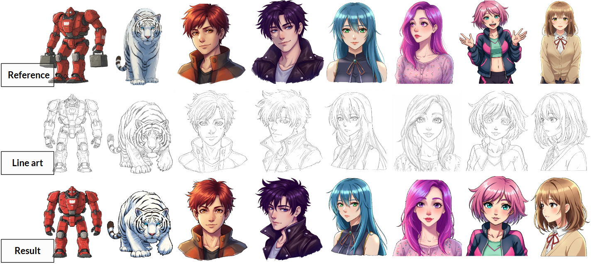
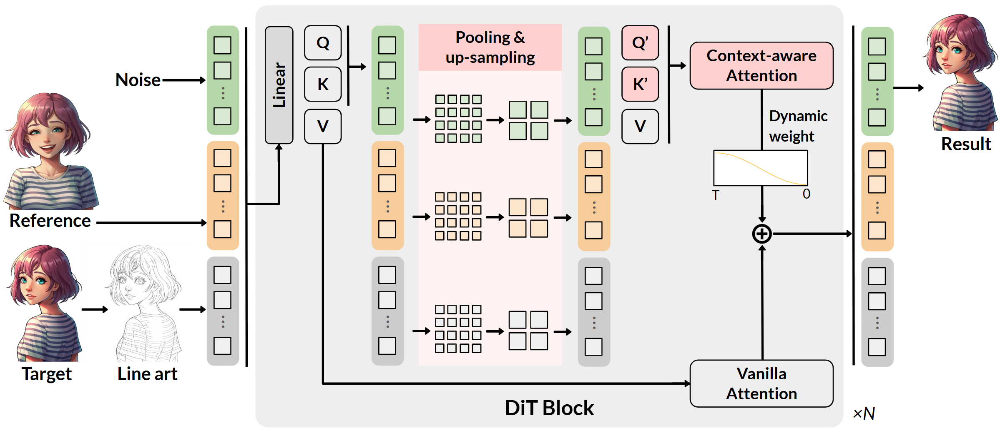

# Reference-Guided Line Art Colorization 

Official implementation of [MangaDiT: Reference-Guided Line Art Colorization with Hierarchical Attention in Diffusion Transformers](http://arxiv.org/abs/2508.09709).



## Introduction

We propose **MangaDiT**, a powerful model for reference-guided line art colorization based on Diffusion Transformers (DiT). Our model takes both line art and reference images as conditional inputs and introduces a hierarchical attention mechanism with a dynamic attention weighting strategy. This mechanism augments the vanilla attention with an additional context-aware path that leverages pooled spatial features, effectively expanding the model’s receptive field and enhancing region-level color alignment. 



## Update
- 2025-10-15: Inference code and paper are released.
- ⭐️ We will open the training code and benchmark datasets publicly upon acceptance of the paper.

## Setup

Dependencies
- GPU: NVIDIA A100-80G * 1

Install and requirements
```
conda create -n mangaDiT python=3.10 -y
conda activate mangaDiT
pip install -r requirements.txt
huggingface-cli login
(using your own huggingface-cli token)
```

### Inference: quick demo with gradio
```
python src/gradio/gradio_demo.py --share
```

## Acknowledgements
This project is developped on the codebase of [FLUX](https://github.com/black-forest-labs/flux) and [OminiControl](https://github.com/Yuanshi9815/OminiControl). We appreciate their great work!

## Citation

```bibtex
@misc{qiu2025mangaditreferenceguidedlineart,
    title={MangaDiT: Reference-Guided Line Art Colorization with Hierarchical Attention in Diffusion Transformers}, 
    author={Qianru Qiu and Jiafeng Mao and Kento Masui and Xueting Wang},
    year={2025},
    eprint={2508.09709},
    archivePrefix={arXiv},
    primaryClass={cs.CV},
    url={https://arxiv.org/abs/2508.09709}, 
}
```
